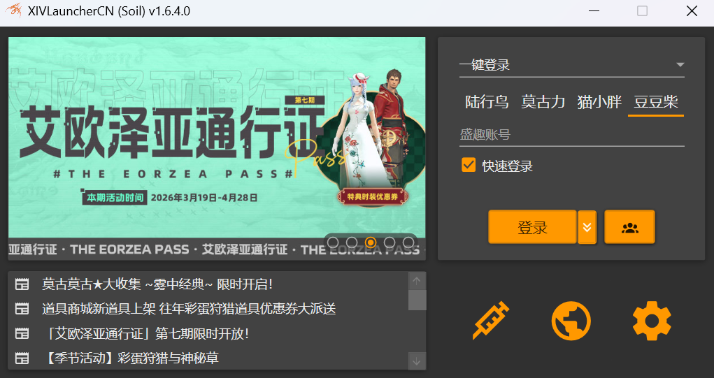

<div align="center">
  <h1>XIVLauncherCN (Soil)</h1>
  


  <p>
    <a href="https://github.com/AtmoOmen/FFXIVQuickLauncher/actions"></a>
    <a href="https://github.com/AtmoOmen/FFXIVQuickLauncher/releases/latest"></a>
    <a href="https://github.com/AtmoOmen/FFXIVQuickLauncher/releases"></a>
    <a href="https://discord.gg/dailyroutines"></a>
  </p>

  <p>
    
    
    
    
  </p>

</div>

<p align="center">
  
</p>

## 分支差异

| 侧重点 | Soil |
| --- | --- |
| 发布链路 | GitHub Actions 自动构建，GitHub Release 发版 |
| 隐私与隔离 | 支持账号级独立设备信息，无任何数据上报逻辑 |
| 平台取舍 | 仅支持 Windows 11 x64 环境，大幅精简代码 |
| 资源自治 | 相关仓库、脚本和资源组织方式清晰可见，无需云服务器托管 <br/> *不必为语焉不详的“服务器资源滥用”时刻担心软件、插件可用性* |
| 插件策略 | 无 Dalamud 启动游戏版本检测，无 Dalamud 插件封禁机制 <br/> *不必忍受奇怪、随心所欲的插件封禁双重标准* |
| 工程与体验 | 大量代码重构、界面优化、操作逻辑优化 |

## 下载与使用

### 直接使用

1. 前往 [Releases](https://github.com/AtmoOmen/FFXIVQuickLauncher/releases/latest) 下载最新版本。
2. 按照启动器引导选择国服游戏目录并完成初始设置。

> [!NOTE]
> 当前分支聚焦 `Windows 10 2004+ / Windows 11` 的 `x64` 环境，不提供 Linux、macOS 与 Steam 相关支持。

### 自行构建

前置要求：

- `Windows x64`
- `.NET SDK 10.0.100` 或更新版本
- 支持 Git 子模块

```powershell
git clone --recurse-submodules https://github.com/AtmoOmen/FFXIVQuickLauncher.git
cd FFXIVQuickLauncher
dotnet restore .\src\XIVLauncher.sln
dotnet build .\src\XIVLauncher.sln -c ReleaseNoUpdate
```

和 CI 一样生成正式发布包：

```powershell
dotnet build .\src\XIVLauncher.sln -c Release
.\scripts\CreateHashList.ps1 .\src\bin\win-x64
```

## 自维护

如果你想基于 Soil 继续维护自己的版本，请一并关注以下仓库：

- [FFXIVQuickLauncher](https://github.com/AtmoOmen/FFXIVQuickLauncher): 启动器本体。
- [XLCNSoilAssets](https://github.com/Dalamud-DailyRoutines/XLCNSoilAssets): 启动器与补丁相关资源。
- [Dalamud (Soil)](https://github.com/Dalamud-DailyRoutines/Dalamud): Dalamud 本体分支。
- [DalamudAssets](https://github.com/Dalamud-DailyRoutines/DalamudAssets): Dalamud 相关静态资源。
- [PluginDistD17](https://github.com/Dalamud-DailyRoutines/PluginDistD17): 插件分发仓库。

## 免责声明

- 本项目为非官方启动器，与 `SQUARE ENIX`、`盛趣游戏` 均无附属关系。
- 使用任何第三方启动器都可能伴随潜在风险，请自行评估并承担后果。
- 项目以社区维护为主，不承诺对所有环境、所有外部服务异常都提供即时支持。

## 鸣谢

- 感谢 [goatcorp/FFXIVQuickLauncher](https://github.com/goatcorp/FFXIVQuickLauncher) 提供长期演化的基础。
- 感谢所有为国服链路、资源整理、插件生态和反馈测试投入时间的人。
- 感谢 [JetBrains OSS Sponsorship](https://www.jetbrains.com/community/opensource/#support) 对开源项目的支持。

<p align="center">
  <a href="https://www.jetbrains.com/community/opensource/#support">
    
  </a>
</p>

---

<div align="center">
  <sub>Final Fantasy XIV © SQUARE ENIX CO., LTD. / 盛趣游戏。<br />本项目仅为社区维护的第三方工具</sub>
</div>
